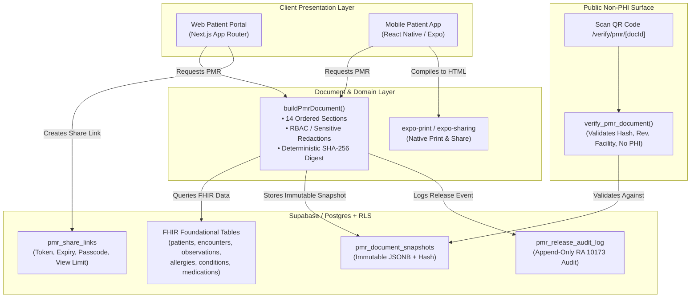

# Patient Medical Record (PMR) - Standardized Clinical Document Specification

## 1. Overview & Architecture

The **Patient Medical Record (PMR)** feature renders a patient's chart as a formal, standardized clinical **DOCUMENT**, rather than an interactive screen. It is print-ready, saveable as PDF/A, and securely shareable with non-repudiation and RA 10173 (Philippine Data Privacy Act) compliance.

A single canonical view-model builder (`buildPmrDocument`) serves as the single source of truth across Web and React Native (Expo) mobile rendering layers.

### Data Flow Diagram



---

## 2. File Organization

```text
packages/
├── types/src/
│   ├── pmr.ts                       # Strict TypeScript models for 14 sections, presets, redactions
│   └── index.ts                     # Re-exports PMR types
├── supabase-client/src/
│   ├── pmr-builder.ts               # buildPmrDocument, persistPmrSnapshot, createPmrShareLink, verify
│   └── index.ts                     # Re-exports PMR builder and schemas
├── ui/src/pmr/
│   ├── pmr-print.css                # Dedicated @media print stylesheet (A4/Letter, break-inside: avoid)
│   ├── PmrPage.tsx                  # Printable page container
│   ├── PmrSection.tsx               # Semantic section header and container
│   ├── PmrTable.tsx                 # Print-repeating thead table with accessibility text flags
│   ├── AlertBanner.tsx              # High-contrast allergy & critical alert banner
│   ├── SignatureBlock.tsx           # Attending physician and records custodian certification
│   ├── QrVerify.tsx                 # Document verification QR code
│   ├── PmrToolbar.tsx               # Print, Save PDF, Page Size (A4/Letter), Secure Share modal
│   ├── PmrDocumentView.tsx          # Formal clinical document view (14 ordered sections)
│   ├── pmr-expo.ts                  # React Native / Expo print, file, and share implementation
│   └── index.ts                     # UI barrel export
apps/patient-web/
├── app/api/pmr/
│   ├── build/route.ts               # Server-side PMR document generation & snapshot API
│   ├── pdf/route.ts                 # Server-side PDF/A printable document endpoint
│   ├── share/route.ts               # Secure share-link creation endpoint
│   └── verify/[docId]/route.ts      # Public non-PHI verification API
├── app/verify/pmr/[docId]/page.tsx   # Public QR verification landing page
├── app/share/pmr/[token]/page.tsx   # Recipient secure viewing portal (passcode & view-limit protected)
└── app/page.tsx                     # Integrated Patient Portal with PMR document trigger buttons
supabase/migrations/
└── 20261002010000_pmr_clinical_document_infrastructure.sql
```

---

## 3. Standard Document Structure (14 Ordered Sections)

1. **Header (repeats across pages):** Facility logo, legal name, address, contact numbers, DOH License Number, PhilHealth Accreditation Number, document title `PATIENT MEDICAL RECORD`.
2. **Document Control Block:** Document ID (`PMR-YYYYMMDD-XXXXX`), Patient MRN, Record Revision, Generation Timestamp (Asia/Manila PST), Generated By (User & Role), Purpose of Release, Copy Type (`Official Copy`, `Patient Copy`, `Uncontrolled Copy`), SHA-256 Digest.
3. **Patient Identification:** Full name, sex/gender, DOB, calculated age, civil status, residential address, telephone, email, emergency contact details, PhilHealth Identification Number (PIN), HMO provider & policy number, blood type.
4. **Alerts Banner:** Allergies and adverse reactions (high criticality highlighted), clinical flags, code status (`Full Code`, `DNR`). Explicit negative statement: `"No known drug allergies (NKDA) reported"` (never blank).
5. **Problem List / Diagnoses:** Active and resolved clinical problems with ICD-10 coding and onset dates.
6. **Current Medications:** Drug generic name, brand name, strength, dosage directions, route, frequency, start date, prescriber details.
7. **Vital Signs Trend:** Latest readings + historical trend table (Blood Pressure, Heart Rate, Respiratory Rate, Temperature in °C, SpO2 %, BMI).
8. **Encounter History:** Reverse chronological visit logs (OPD, IPD, Teleconsult, ER), attending physician, chief complaint, SOAP summary, diagnoses, orders, clinical disposition.
9. **Laboratory and Diagnostic Results:** Diagnostic test, observed value, unit, reference interval, abnormal flag (`H`, `L`, `CRITICAL`, `NORMAL`), collection and result dates.
10. **Procedures, Immunizations, Referrals, Certificates:** Surgical/clinical procedures, immunization batch/lot details, inter-facility referrals, and issued medical fit-to-work certificates.
11. **Past Medical, Surgical, Family, and Social History:** Past illnesses, prior surgeries, hereditary risk factors, tobacco/alcohol/lifestyle history.
12. **Attachments Index:** Catalog of linked diagnostic scans and attachments (title, type, reference ID) without embedding heavy binary data.
13. **Attestation and Signature Block:** Attending physician signature line, PRC License Number, PTR Number, S2 Narcotics License, date/time signed. Records Custodian certification block for `Official Copy`.
14. **Footer:** Page X of Y, Document ID, Philippine Republic Act 10173 statutory confidentiality notice, and QR code for authenticity verification.

---

## 4. Key Assumptions & Compliance Design Decisions

1. **Philippine Data Privacy Act of 2012 (RA 10173):**
   - Public verification (`/verify/pmr/[docId]`) deliberately outputs zero Protected Health Information (PHI). It validates validity, facility name, issuance timestamp, revision, and cryptographic SHA-256 match only.
   - Sensitive categories (`mental_health`, `infectious_disease_hiv`, `reproductive_health`, `substance_use`, `genetic_testing`) are automatically redacted with an explicit disclaimer unless explicitly consented to in the release options.
2. **Immutable Document Snapshots:**
   - Generated documents are saved to `pmr_document_snapshots` with their canonical SHA-256 hash.
   - Postgres triggers prohibit any UPDATE or DELETE operations on snapshots and release audit logs.
3. **Watermark Rules:**
   - Draft or unsigned records display `UNCONTROLLED COPY`.
   - Records that have been amended or superseded by subsequent chart revisions display `VOID`.
4. **Print and Accessibility (WCAG 2.2 AA):**
   - High contrast ratios (exceeding 4.5:1 text, 3:1 graphical elements).
   - Never relies on color alone: abnormal laboratory values utilize explicit textual abbreviations (`H`, `L`, `CRITICAL`, `NORMAL`).
   - Pure CSS `@page` margin formatting (15–20 mm) with `break-inside: avoid` on all cards, table rows, and section headers to eliminate orphan headings.
