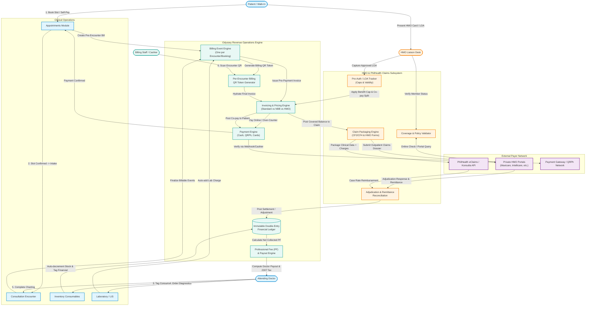
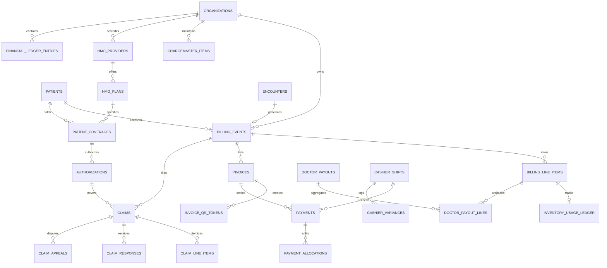

# Odyssey Healthcare OS: Revenue Operations & HMO Claims Architecture Review
**Comprehensive Systems Architecture, Financial Subledger Specification, and Regulatory Review**

*Document ID:* `ODC-ARCH-REVOPS-2026-V1`  
*Target Release:* Odyssey Healthcare OS v2.0 (Phase 1 Single-Hospital Production & Phase 2 Multi-Tenant Federated Network)  
*Status:* Draft for Technical Review & Executive Sign-off  
*Region:* Republic of the Philippines (PHP / ₱)  
*Standards:* HL7 FHIR R4, BIR RR/EOPT RA 11976, DPA RA 10173, PhilHealth UHC RA 11223  

---

## Table of Contents
1. [Feature Scope and Boundaries](#1-feature-scope-and-boundaries)
2. [Actors, Roles and Permissions](#2-actors-roles-and-permissions)
3. [End-to-End Workflows](#3-end-to-end-workflows)
4. [Data Model & Financial Subledger](#4-data-model--financial-subledger)
5. [State Machines & Transition Logic](#5-state-machines--transition-logic)
6. [Business Rules and Edge Cases](#6-business-rules-and-edge-cases)
7. [Compliance, Security and Audit](#7-compliance-security-and-audit)
8. [Integrations and Interoperability](#8-integrations-and-interoperability)
9. [UX and Screen Inventory](#9-ux-and-screen-inventory)
10. [Analytics and KPIs](#10-analytics-and-kpis)
11. [Engineering Plan & Technical Architecture](#11-engineering-plan--technical-architecture)
12. [Delivery Plan (Vertical Slice Loops)](#12-delivery-plan-vertical-slice-loops)
13. [Gaps, Risks and Open Questions](#13-gaps-risks-and-open-questions)
14. [Executive Summary](#14-executive-summary)

---

## 1. Feature Scope and Boundaries

### 1.1 In-Scope & Out-of-Scope Boundaries

```
┌────────────────────────────────────────────────────────────────────────────────────────┐
│                                 ODYSSEY HEALTHCARE OS                                  │
│ ┌────────────────────────────────────────┐  ┌────────────────────────────────────────┐ │
│ │          REVENUE OPERATIONS            │  │      HMO CLAIMS & AUTHORIZATIONS       │ │
│ │ • Charge Capture (Services/Meds/Labs)  │  │ • Member Card & Eligibility Check      │ │
│ │ • Pre-Encounter Booking Invoicing      │  │ • Pre-Auth & LOA (Letter of Auth) Mgmt │ │
│ │ • Multi-tender Point-of-Sale (POS)     │  │ • Policy Coverage & Benefit Caps       │ │
│ │ • Realtime Payment Confirmations       │  │ • Claim Packaging (UB-04/CF2/CF4 shape)│ │
│ │ • Patient Receivables & Co-Pay Ledgers │  │ • Batch & Portal Submission Tracking   │ │
│ │ • Refunds, Voids, and Credit Memos     │  │ • Remittance & EOB Adjudication         │ │
│ │ • Professional Fee (PF) Splitting      │  │ • Denials, Re-filings & Appeals Queue  │ │
│ │ • Doctor Payout Accounting & BIR 2307  │  │ • PhilHealth eClaims / Konsulta Bridge │ │
│ │ • Shift Cash-Drawer Reconciliation     │  │ • Payor Balance Transfers              │ │
│ └────────────────────────────────────────┘  └────────────────────────────────────────┘ │
└────────────────────────────────────────────────────────────────────────────────────────┘
```

#### Revenue Operations (RevOps)
* **What it Covers:**
  * Realtime charge capture from appointment booking, clinical encounters, consumable tagging, laboratory orders, and direct retail pharmacy/POS.
  * Invoicing with support for multi-payor line items (Patient Self-Pay, Private HMO, PhilHealth NBB, Corporate Subsidy).
  * Multi-channel payment acceptance: Cash, Terminal Card (Debit/Credit), QRPh / e-Wallet (GCash, Maya), Bank Transfers, and Direct Online Gateways.
  * Strict transaction integrity: Single-source double-entry financial ledger recording gross charges, contractual allowances, statutory discounts, payments, write-offs, and refunds.
  * Doctor professional fee (PF) accounting: Fixed government rates, private practitioner CMS-declared tariffs, covering doctor split rules, hospital administrative withholdings, and Philippine Bureau of Internal Revenue (BIR) Form 2307 creditable withholding tax computation (10% or 15%).
  * Cash-drawer management: Shift open/close, expected vs. counted cash reconciliation, cashier variance logs, and consolidated daily cash-out deposits.
  * Month-end Accounts Receivable (A/R) subledger close, bad debt write-offs, and aged trial balances (30/60/90/120+ days).
* **What it Does NOT Cover:**
  * General ledger (GL) ERP functions (e.g., hospital asset depreciation, staff payroll, facility lease accounting). Odyssey RevOps acts as an **operating subledger** exporting BIR-compliant journal entries and summaries via CSV/API to external accounting systems (e.g., SAP, Oracle, Xero, QuickBooks).
  * Direct physical cash disbursement for doctor payouts. Odyssey tracks accrued payout liabilities, withholding taxes, and remittance files; bank transfers are executed via batch PESONet/InstaPay or corporate check issuance.

#### HMO Claims and Authorizations
* **What it Covers:**
  * Patient insurance master management: Member ID, policy group, validity window, principal vs. dependent relationships, and policy card image storage.
  * Eligibility check tracking (portal confirmation timestamps, approval reference tokens).
  * Outpatient pre-authorization / Letter of Authorization (LOA) lifecycle: Request, approved benefit caps, validity expiry (typically 24–72 hours for outpatient consults), approved procedure codes, and extension requests.
  * Claim packaging: Mapping encounter clinical notes (FHIR `Encounter`, `Observation`), diagnostic lab results (`DiagnosticReport`), prescriptions (`MedicationRequest`), and itemized billing lines into standardized claim dossiers.
  * Claim submission tracking: Portal-based dispatch, SFTP batch transmissions, clearinghouse bridges, adjudication response processing (Full Approval, Partial Approval, Denial), and dispute/appeals management.
  * PhilHealth integration bridge: Packaging PhilHealth Benefit Claims, Case Rate computation (First and Second Case Rates), No Balance Billing (NBB) enforcement, and Claim Form (CF2/CF4) data readiness.
* **What it Does NOT Cover:**
  * HMO underwriting, premium collection, or primary risk actuarial management (handled exclusively by the payer).
  * Direct adjudicative AI underwriting on behalf of the HMO; Odyssey formats, validates, submits, and tracks claims against agreed-upon rules.

---

### 1.2 Module Touchpoint Matrix

| Module | Integration Direction | Event / Data Exchanged | Rationale & Mechanism |
| :--- | :--- | :--- | :--- |
| **Appointments** | Bidirectional | `appointment.booked` → Generates `billing_event` & initial `invoice`. `payment.confirmed` → Sets appointment status to `confirmed`. | **[Constraint 1]** Enforces the slot-confirmation rule; prevents calendar bloat from unpaid bookings. |
| **Triage** | Outbound from RevOps | Checks appointment payment or NBB flag before allowing triage intake. | Prevents unconfirmed or non-eligible walk-in patients from consuming clinical staff time. |
| **Encounter** | Bidirectional | Clinical documentation completion triggers invoice generation and freezes billable event lines; QR token pulls invoice. | **[Constraint 3, 5]** Ties clinical consumption directly to the financial account; ensures auditable billing QR scanning at the cashier. |
| **Inventory** | Bidirectional | `inventory_usage.tagged` decrements on-hand stock and creates an immutable row in `inventory_usage_financial_ledger` (`tagged` state). | **[Constraint 3]** Decouples physical stock decrement from financial realization; prevents untracked consumable leakage. |
| **Laboratory (mini-LIS)** | Inbound to RevOps | Doctor orders a lab procedure (`ServiceRequest`) → Auto-inserts `billing_line_item` with `source_type = 'laboratory_service'`. | **[Constraint 4]** Guarantees zero missed billing for diagnostic services ordered in the consultation room. |
| **Prescriptions** | Inbound to RevOps | Prescribed outpatient medications generate a billable pharmacy cart if dispensed by the in-house hospital pharmacy. | Prevents duplicate entries between the doctor's chart and the outpatient pharmacy dispensary. |
| **POS (Retail)** | Inbound to RevOps | Over-the-counter sales without an encounter link directly to a standalone `billing_event` and `pos_sales` receipt. | Supports retail pharmacy and retail medical supply transactions within the same unified ledger. |
| **Teleconsult** | Bidirectional | Upfront payment confirms WebRTC room reservation; limits post-encounter orders to e-prescriptions, lab requests, and referrals. | Mitigates non-payment risk for remote virtual visits where physical containment at the billing desk is impossible. |
| **RBAC / Tenant CMS** | Inbound to RevOps | Resolves user roles, clinic-specific permission overrides, and doctor fee schedules (`practitioner_payout_settings`). | Guarantees strict multi-tenant data isolation and enforces segregation-of-duties across all billing actions. |
| **Analytics** | Outbound from RevOps | Streams financial transaction records to analytical rollups (Days in A/R, Collection Rate, Net Revenue, Denial Rates). | Delivers executive visibility without impacting high-throughput OLTP database performance. |

---

### 1.3 System Context Diagram (Data and Event Flow)



---

## 2. Actors, Roles and Permissions

### 2.1 Role-Based Access Control (RBAC) Matrix

| Actor / Role | View Financials | Create / Tag Charges | Collect Payment | Pre-Auth / LOA | Submit Claims | Approve Write-offs / Voids | Manage Payouts | Export Tax & BIR Reports |
| :--- | :---: | :---: | :---: | :---: | :---: | :---: | :---: | :---: |
| **Patient** | Self Only (Own Invoices/Receipts) | ❌ | Self Only (Pay Own Bill) | View Own LOAs | ❌ | ❌ | ❌ | Download Official Receipts |
| **Doctor / Attending** | View Own PF Accruals & Encounters | Tag Consumables & Lab Orders | ❌ | View Auth Status | ❌ | ❌ | View Own Settlement Slips | View Own 2307 Certificates |
| **Nurse / Clinical Staff** | View Consumables on Encounter | Tag Encounter Consumables | ❌ | View Auth Status | ❌ | ❌ | ❌ | ❌ |
| **Billing Clerk / Cashier** | Full Clinic Invoices & Bills | Add Manual Encounter Charges | Accept & Record Payments | View LOA | ❌ | Request Void (No Direct Approval) | ❌ | Print Shift Balance Slip |
| **HMO Desk / Liaison** | Coverage, LOA & Claim Amounts | ❌ | ❌ | Create, Edit, Extend LOA | Package, Submit, Appeal Claims | ❌ | ❌ | Export Payer Aging Reports |
| **Finance Manager / Supervisor**| Full Clinic Accounts & Ledgers | Override Billing Discrepancies | Supervise Cashier Shifts | Supervise LOA Splits | Approve Final Claims Submission | **Approve Voids, Write-offs, Discounts** | **Approve & Finalize Doctor Payouts** | **Full Export (BIR, Ledger, Bank CSV)** |
| **Clinic Admin** | Audit Logs & Settings | ❌ | ❌ | ❌ | ❌ | View Approved Adjustments | View Payout Rules | View Financial Summaries |
| **Superadmin (Multi-Tenant)**| Platform Health & Schema Only | ❌ | ❌ | ❌ | ❌ | ❌ | ❌ | ❌ (No Cross-Tenant Data Access) |
| **External HMO / PhilHealth** | Claims & Adjudication Requests | ❌ | ❌ | Approve/Deny LOA (API) | Adjudicate Claims (Inbound) | ❌ | ❌ | Remittance Advice Files |

---

### 2.2 Odyssey Roles CMS Permission Keys

To maintain compatibility with `public.clinic_role_permissions_cms` and existing tenancy helpers (`has_organization_permission`), the following permission keys are established:

```typescript
// packages/types/src/permissions.ts
export const REVOPS_PERMISSIONS = {
  // Billing & Invoicing
  BILLING_VIEW: 'billing.view',                     // Read invoices, line items, and encounters
  BILLING_MANAGE: 'billing.manage',                 // Add/edit manual line items, change payor type
  BILLING_QR_SCAN: 'billing.qr_scan',               // Scan encounter QR and hydrate cashier terminal
  BILLING_PRICE_OVERRIDE: 'billing.price_override', // Override master catalog price (Audited)

  // Payments & Cashier Operations
  PAYMENT_COLLECT: 'payment.collect',               // Accept Cash, Card, QRPh; issue official receipts
  PAYMENT_VOID_REQUEST: 'payment.void.request',     // Request a payment reversal / refund
  PAYMENT_VOID_APPROVE: 'payment.void.approve',     // Supervisor authorization to reverse collected funds
  CASH_DRAWER_CLOSE: 'cash_drawer.close',           // Perform shift end count and variance declaration

  // HMO & Authorizations
  HMO_ELIGIBILITY_VERIFY: 'hmo.eligibility.verify', // Check member active status with payer
  HMO_LOA_MANAGE: 'hmo.loa.manage',                 // Record, adjust, or extend LOA pre-authorizations
  HMO_CLAIM_CREATE: 'hmo.claim.create',             // Assemble claim packages from clinical documentation
  HMO_CLAIM_SUBMIT: 'hmo.claim.submit',             // Transmit claim to HMO/PhilHealth portal
  HMO_CLAIM_ADJUDICATE: 'hmo.claim.adjudicate',     // Post settlement remittances and claim variances
  HMO_CLAIM_APPEAL: 'hmo.claim.appeal',             // Re-file denied claims with supplementary records

  // Professional Fees & Payouts
  PF_RATES_MANAGE: 'pf.rates.manage',               // Configure doctor fixed or percentage fee rules
  PAYOUT_CALCULATE: 'payout.calculate',             // Execute monthly/bi-weekly payout batches
  PAYOUT_APPROVE: 'payout.approve',                 // Final finance sign-off on payout disbursement
  PAYOUT_EXPORT_BIR: 'payout.export_bir',           // Generate BIR 2307 and bank payroll files

  // Financial Governance & Reporting
  WRITE_OFF_APPROVE: 'financial.write_off.approve', // Authorize bad-debt or uncollectible write-offs
  FINANCIAL_AUDIT_EXPORT: 'financial.audit.export', // Export unmasked financial ledgers and tax records
} as const;

export type RevOpsPermission = typeof REVOPS_PERMISSIONS[keyof typeof REVOPS_PERMISSIONS];
```

---

### 2.3 Segregation-of-Duties (SoD) & Fraud Risk Matrix

1. **Risk 1: Unauthorized Payment Voiding / Pocketing Cash**
   * *Threat Vector:* A cashier receives ₱1,500 in cash, issues an official receipt, then marks the payment as "Void / Entered in Error" in the system and pockets the physical banknotes.
   * *Mitigation Rule:* Enforce dual-custody authorization. A cashier with `payment.collect` can only file a `payment_void_request`. The void remains non-functional until a supervisor holding `payment.void.approve` signs off with an authenticated session.
   * *Database Guard:* A database trigger on `payments` prohibits any update of `status = 'refunded'` or `'void'` unless `auth.uid()` possesses `payment.void.approve` and is distinct from `recorded_by`.

2. **Risk 2: Write-Off Manipulation to Conceal Shortages**
   * *Threat Vector:* Billing personnel zero out outstanding balances for acquaintances or to hide cash deficits by classifying legitimate self-pay receivables as "Indigent / Write-Off / Bad Debt".
   * *Mitigation Rule:* `financial.write_off.approve` is restricted to Finance Managers. All write-offs require an explicit pre-configured categorization (e.g., *Medical Social Services Assessment*, *Uncollectible Deceased*, *Administrative Settlement*) along with an attached digital justification document.

3. **Risk 3: Self-Declared Professional Fee Inflations**
   * *Threat Vector:* A private doctor with access to the CMS sets exorbitant consultation fees right before an encounter is billed to exploit an HMO maximum benefit limit or inflate clinic commission.
   * *Mitigation Rule:* Price freeze at booking/encounter creation. While doctors can update their base tariff in CMS, any active booking snapshots the price at the moment the appointment was scheduled. Upward adjustments during an active encounter require billing supervisor sign-off.

4. **Risk 4: Payout Self-Approval**
   * *Threat Vector:* A physician who also serves as an administrative director approves their own professional fee payout batch.
   * *Mitigation Rule:* Separation of calculation and approval. The system prohibits any user from approving a payout batch where their own `practitioner_id` is an itemized recipient; the batch must be split or countersigned by an independent financial controller.

---

## 3. End-to-End Workflows

### Workflow 3.a: Charge Capture to Invoice
* **Trigger:** Patient books an appointment, clinical staff tags an item/consumable, or a doctor completes an encounter order.
* **Preconditions:** Active clinic tenant; valid patient record; published chargemaster.
* **Step-by-Step Flow:**
  1. *Booking Charge:* At booking, system evaluates service pricing. An initial `billing_event` (`draft`) and `billing_line_item` (`source_type = 'clinic_service'`) are generated.
  2. *Clinical Consumption:* During the encounter, the physician orders an injectable antibiotic. Nurse tags the stock in the UI.
  3. *Ledger Creation:* Stock decrements immediately in `inventory_levels`. An immutable entry is written to `inventory_usage_financial_ledger` (`state = 'tagged'`). A corresponding `billing_line_item` is inserted into the active `billing_event`.
  4. *Diagnostic Orders:* Attending physician orders a Complete Blood Count (CBC). Mini-LIS hook intercepts the order and automatically generates a `billing_line_item` (`source_type = 'laboratory_service'`).
  5. *Professional Fee Snapshot:* Attending doctor's consultation fee is retrieved from `practitioner_fee_schedules` and snapshotted into `billing_line_items` (`source_type = 'professional_fee'`).
  6. *Invoice Compilation:* System calculates gross subtotal, checks patient payor eligibility, and updates the draft `invoice`.
* **State Transitions:**
  * `billing_events`: `draft` → `finalized` (upon encounter completion).
  * `invoices`: `draft` → `issued`.
  * `inventory_usage_financial_ledger`: `tagged` → `unbilled`.
* **Postconditions:** All consumed goods and clinical services are locked into line items with frozen unit prices.
* **Failure Paths:**
  * *Negative Stock on Tagging:* If physical stock is 0, the system prompts: "Physical stock depleted. Override for emergency care?" If confirmed by nurse, item is tagged with an `inventory_discrepancy` flag for post-encounter auditing.
* **Actor:** Patient (Booking), Nurse (Consumables), Doctor (Orders/PF), System Engine.

---

### Workflow 3.b: Payment Collection & Slot Confirmation
* **Trigger:** Patient arrives at payment step online or presents at billing desk.
* **Preconditions:** `invoice` exists in `issued` state; `amount_paid < total_due`.
* **Step-by-Step Flow:**
  1. Cashier scans per-encounter billing QR token or patient accesses mobile payment link.
  2. Cashier selects tender type:
     * *Cash:* Enters amount tendered; system computes change; cashier clicks "Confirm Collection".
     * *Terminal Card:* Enters reference/approval code from physical POS terminal.
     * *Dynamic QRPh / e-Wallet:* System generates a dynamic QR code containing invoice ID and exact centavo amount.
  3. System initiates an atomic Postgres transaction:
     * Inserts record into `payments` (`status = 'confirmed'`).
     * Increments `invoice.amount_paid` and decrements `invoice.balance_due`.
     * If `balance_due == 0`, sets `invoice.status = 'paid'`.
     * **[Constraint 1]** If payment covers booking fee in full: sets `appointments.status = 'confirmed'`, triggers Realtime broadcast to provider queue.
  4. System generates a serialized Bureau of Internal Revenue (BIR)-compliant Electronic Official Receipt (e-OR) or Sales Invoice.
* **State Transitions:**
  * `payments`: `pending` → `confirmed`.
  * `invoices`: `issued` → `paid`.
  * `appointments`: `pending_payment` → `confirmed`.
* **Postconditions:** Slot is securely locked; patient is eligible for nurse triage.
* **Failure Paths:**
  * *Partial Payment Attempt:* If patient offers less than the full booking fee, the UI blocks confirmation: *"Full payment of ₱[Amount] required to confirm appointment slot."* Transaction terminates without updating slot status.
  * *Gateway Timeout / Flaky Connection:* Payment gateway webhook drops. System provides cashier a "Re-check Online Status" button which polls the gateway via Edge Function before falling back to manual reference entry.
* **Actor:** Patient, Billing Clerk / Cashier, Payment Gateway.

---

### Workflow 3.c: Government / No Balance Billing (NBB) Flow
* **Trigger:** Patient booked or checked in at a designated government facility or rural health unit (RHU).
* **Preconditions:** Clinic configuration `facility_classification = 'government'` or service marked `nbb_eligible = true`; patient has verified PhilHealth Indigent, Sponsored, Senior Citizen, or 4Ps status.
* **Step-by-Step Flow:**
  1. System checks clinic and service master flags. Detects `billing_mode = 'nbb'`.
  2. Patient is scheduled or triaged immediately without requiring upfront payment **[Constraint 1 Exception]**. `appointments.status` transitions directly to `confirmed`.
  3. Clinical encounter occurs: consumables, tests, and standard clinical services are tagged.
  4. **[Constraint: Standard Price Retained]** System records each `billing_line_item` using standard chargemaster unit prices.
  5. Invoicing engine splits the line items:
     * `patient_responsibility_amount = 0` (₱0.00).
     * `payor_responsibility_amount = line_total`.
     * `invoices.status` is set to `paid` with a payment line referencing `method = 'philhealth_nbb'` and `discount_type = 'nbb_statutory_subsidy'`.
  6. Clinical items are packaged into a PhilHealth Case Rate Claim dossier.
* **State Transitions:**
  * `appointments`: `pending` → `confirmed` (bypassing cash payment).
  * `invoices`: `draft` → `issued` → `paid` (with net patient balance = ₱0).
  * `claims`: `unsubmitted` → `ready_for_packaging`.
* **Postconditions:** Patient leaves facility without out-of-pocket payment; hospital retains an auditable record of gross healthcare cost for government accounting and PhilHealth reimbursement.
* **Failure Paths:**
  * *Service Outside NBB Package:* Doctor orders non-formulary medication or non-covered test. System alerts: *"Item not covered under NBB Case Rate. Requires Medical Social Services clearance or Patient Out-of-Pocket Consent Form."*
* **Actor:** Attending Physician, Billing Staff, HMO/PhilHealth Officer.

---

### Workflow 3.d: HMO Member Eligibility Verification
* **Trigger:** Patient adds HMO coverage to their profile or arrives at clinic reception.
* **Preconditions:** Patient holds an active membership card with an accredited HMO partner (e.g., Maxicare, Intellicare, Medicard).
* **Step-by-Step Flow:**
  1. HMO desk scans physical HMO card barcode/QR or enters Member ID, Company Account, and Date of Birth into Odyssey.
  2. System checks local `coverages` table for active cached verification.
  3. If expired or missing, HMO officer initiates verification request:
     * *Direct API Tier:* Edge function queries HMO gateway with member credentials.
     * *Portal Tier (Manual Fallback):* Officer opens HMO web portal in side panel, validates active status, and enters the Portal Verification Code and Maximum Benefit Limit (MBL) into Odyssey.
  4. Odyssey records a `coverage_eligibility_responses` audit log with: Valid/Invalid status, expiry date, copay requirements, and remaining annual benefit limit.
* **State Transitions:**
  * `coverages`: `unverified` → `verified` (or `inactive` / `expired`).
* **Postconditions:** Coverage record is linked to patient and made selectable for upcoming encounters.
* **Failure Paths:**
  * *Member Inactive / Delinquent Corporate Account:* Verification fails with reason code `MEMBER_SUSPENDED`. System alerts desk: *"HMO card inactive. Switch visit billing to Self-Pay?"*
* **Actor:** Patient, HMO Liaison Clerk.

---

### Workflow 3.e: Authorization / Letter of Authorization (LOA) Lifecycle
* **Trigger:** Patient requires a consultation, specialized diagnostic test, or minor procedure under HMO coverage.
* **Preconditions:** Patient coverage is `verified`.
* **Step-by-Step Flow:**
  1. *Request Creation:* HMO desk selects encounter and ordered services. Enters provisional ICD-10 diagnostic code provided by physician.
  2. *LOA Transmission:* Request is dispatched to HMO portal or generated as an electronic LOA form.
  3. *Adjudication & Approval:*
     * *Full Approval:* HMO issues LOA reference number with an approved ceiling (e.g., ₱2,500).
     * *Partial Approval:* HMO approves consultation (₱800) but denies specialized ultrasound (₱1,700) due to policy exclusion.
  4. *System Entry:* Desk records LOA number, approved amount, approved procedure codes, and authorization validity period (typically 72 hours).
  5. *Attachment to Invoice:* System creates an `authorizations` record linked to the `billing_event`. Covered line items are locked to `payor_type = 'hmo'`.
  6. *Expiry & Extension:* If encounter is postponed past LOA validity, system flags record as `expired`. Desk submits an extension request to HMO portal and updates `valid_until` upon confirmation.
* **State Transitions:**
  * `authorizations`: `requested` → `approved` (or `partially_approved`, `rejected`, `expired`).
  * `billing_line_items`: `payor_type` updated from `self_pay` to `hmo`.
* **Postconditions:** Financial liability for approved items shifts from patient to HMO up to authorized ceiling.
* **Failure Paths:**
  * *LOA Ceiling Exceeded:* Total tagged services amount to ₱3,200 against an approved LOA of ₱2,500. System triggers Workflow 3.i (Co-Pay Split).
* **Actor:** HMO Desk Officer, Payer Approver.

---

### Workflow 3.f: HMO Claim Bundling, Submission, & Adjudication
* **Trigger:** Encounter finalized; patient discharged; billing QR scanned and finalized.
* **Preconditions:** Encounter has valid LOA attached; doctor completed clinical chart and signed diagnosis.
* **Step-by-Step Flow:**
  1. *Claim Assembly:* System Claim Packaging Engine aggregates:
     * Encounter summary and provider accreditation numbers.
     * Primary and secondary ICD-10 codes.
     * Itemized billable lines with mapped HMO procedure codes.
     * Digital scan or PDF of signed LOA.
  2. *Clean-Claim Validation:* System runs automated pre-submission rule checks:
     * Does procedure code match LOA approved scope?
     * Is doctor accredited with this specific HMO network?
     * Are mandatory diagnostic indicators present?
  3. *Batch Dispatch:* Claims Officer groups clean claims into an electronic batch (or prepares individual portal submission dossier) and marks batch as `submitted`.
  4. *Remittance Processing:* HMO releases Electronic Remittance Advice (ERA) or check voucher after 30–60 days:
     * System ingests remittance file.
     * Matches payment against `claims.claim_number`.
  5. *Reconciliation Posting:*
     * Approved amount posted to `claims`.
     * Cash/Check settlement recorded in `payments` against HMO accounts receivable.
     * Difference posted as contractual allowance or adjustment.
* **State Transitions:**
  * `claims`: `draft` → `ready_to_file` → `submitted` → `adjudicated` → `settled`.
* **Postconditions:** HMO Accounts Receivable balance decremented; invoice fully closed.
* **Failure Paths:**
  * *Remittance Discrepancy:* HMO pays ₱1,800 on a ₱2,000 claim due to administrative deduction. System posts ₱1,800 to settlement and moves ₱200 to `adjudication_discrepancy` queue for supervisor review.
* **Actor:** HMO Claims Officer, Finance Manager.

---

### Workflow 3.g: Claim Denial, Appeal, & Resubmission
* **Trigger:** HMO remittance or portal indicates claim status `denied`.
* **Preconditions:** Claim was in `submitted` state; official denial notice received with payer reason code.
* **Step-by-Step Flow:**
  1. HMO desk reviews denial queue. Common Philippine HMO denial codes:
     * `PRE_EXISTING_CONDITION` (Not covered under first-year policy rider).
     * `LACK_OF_PRIOR_AUTH` (Procedure performed differed from LOA text).
     * `INCOMPLETE_CLINICAL_INFO` (Missing laboratory report or doctor signature).
  2. Officer initiates Appeal:
     * Creates an `appeals` record tied to `claim_id`.
     * Collects supplemental documentation from doctor (e.g., expanded SOAP note, certified lab printout, doctor justification letter).
  3. Officer resubmits claim dossier with reference to original claim number and appeal justification code.
  4. Payer reviews appeal:
     * *Appeal Upheld:* HMO approves claim. Status transitions to `settled`.
     * *Appeal Denied (Final):* HMO confirms rejection.
  5. If final denial is confirmed: Finance Manager decides whether to transfer balance to Patient Self-Pay or execute an authorized bad-debt write-off.
* **State Transitions:**
  * `claims`: `denied` → `appealed` → `settled` OR `written_off`.
* **Postconditions:** Financial ledger accurately reflects recovery or loss; audit trail captures all communications and supporting clinical files.
* **Failure Paths:**
  * *Appeal Filing Window Expired:* HMO contractual agreement dictates appeals must be filed within 30 days of denial notice. System alerts officer 5 days before cutoff.
* **Actor:** HMO Claims Officer, Attending Doctor (Justifications), Finance Manager.

---

### Workflow 3.h: PhilHealth Outpatient Claim Flow (Case Rates / Konsulta)
* **Trigger:** Patient treated under an accredited PhilHealth outpatient package (e.g., PhilHealth Konsulta comprehensive outpatient consultation, outpatient minor surgery, hemodialysis).
* **Preconditions:** Patient PhilHealth Identification Number (PIN) verified; facility accredited; doctor PhilHealth-accredited.
* **Step-by-Step Flow:**
  1. Patient presents PhilHealth Member Data Record (MDR) or PIN. System runs eligibility check against PhilHealth database/portal.
  2. Attending doctor records primary diagnosis (ICD-10) and outpatient surgical/diagnostic procedure (RVS 2001 code).
  3. System matches ICD-10/RVS pairing against PhilHealth Case Rate Master:
     * Computes First Case Rate and Second Case Rate (if applicable, with 50% rule on lower package).
     * Splits case rate into: **Hospital Fee (HF)** and **Professional Fee (PF)** components.
  4. System populates standard PhilHealth claim documents:
     * **Claim Form 1 (CF1):** Member and patient demographic data.
     * **Claim Form 2 (CF2):** Facility charges, case rate codes, accreditation numbers.
     * **Claim Form 4 (CF4):** Detailed clinical summary (chief complaint, vital signs, physical exam, medications, diagnostic results).
  5. System generates an eClaims-compliant XML/JSON package and transmits via PhilHealth accredited Health Information Technology Provider (HITP) or HCI portal bridge.
* **State Transitions:**
  * `claims`: `draft` → `ready_for_transmission` → `transmitted` → `in_process` → `paid`.
* **Postconditions:** Claim tracked against PhilHealth 60-day statutory processing timeline; hospital fee accrued to clinic, professional fee reserved for doctor payout.
* **Failure Paths:**
  * *PhilHealth Return to Hospital (RTH):* Claim returned due to mismatched member name spelling or missing signature on CF4. Moves to RTH queue for front-desk correction and re-upload.
* **Actor:** Billing Staff, Medical Records Officer, PhilHealth Desk.

---

### Workflow 3.i: Co-Pay / Balance Split vs. Pay-In-Full Rule Conflict Resolution
* **Context / Problem Statement:** Fixed constraint #1 specifies: *"Booking → appointment bill generated → slot confirms only after full payment (no partial payments)."* However, HMO patients frequently have an authorized LOA covering a portion of the fee, with an out-of-pocket co-payment (e.g., ₱300 co-pay on a ₱1,000 consult, or non-covered ultrasound fee).
* **Conflict Resolution Mechanism:**
  * The "No Partial Payment" rule is strictly interpreted as: **Every line item on the invoice must be 100% assigned and satisfied across authorized parties before confirmation.**
  * The invoice balance due is split into two independent liabilities:
    1. `hmo_liability` = ₱700 (covered by valid LOA token).
    2. `patient_liability` = ₱300 (patient co-pay).
  * The patient cannot pay ₱150 of their ₱300 co-pay; **the entire patient liability (₱300) must be paid in full upfront** before the slot or encounter confirmation is finalized.
* **Step-by-Step Flow:**
  1. System compiles bill: Total = ₱1,000.
  2. System binds approved LOA: Allocates ₱700 to `claims_receivable`. Net balance due from patient = ₱300.
  3. Patient attempts to pay ₱100: System rejects transaction.
  4. Patient tenders full ₱300 co-pay via Cash or QRPh: System executes atomic confirmation.
  5. Invoice marked `co_pay_satisfied`; appointment slot confirmed; financial ledger reflects ₱300 cash collected and ₱700 pending claim submission.
* **State Transitions:**
  * `invoices`: `issued` → `partially_covered_by_auth` → `paid_in_full`.
* **Postconditions:** Zero outstanding unallocated balance; zero partial payments permitted.
* **Actor:** Billing Clerk, Patient.

---

### Workflow 3.j: Refunds, Voids, Credit Notes, & Post-Payment Cancellations
* **Trigger:** Patient cancels an appointment prior to cancellation window, encounter is aborted, or an incorrect item was billed and collected.
* **Preconditions:** Payment exists in `confirmed` status; Official Receipt was issued.
* **Step-by-Step Flow:**
  1. *Request Initiation:* Cashier or front-desk clerk submits a Cancellation/Refund Request specifying: Transaction ID, reason code (e.g., *Doctor Emergency Absence*, *Double Charge*, *Duplicate Booking*), and requested refund method.
  2. *Supervisory Review:* Finance Supervisor reviews the audit log and verifies whether services or consumables were already consumed.
  3. *Approval & Ledger Reversal:*
     * Supervisor enters PIN/session credentials to authorize.
     * System **never deletes or modifies the original payment row**.
     * System inserts a compensating entry in `financial_ledger_entries` (Credit Cash/Bank, Debit Patient Revenue).
     * System inserts a `payments` row with negative value or `payment_type = 'refund'` linked to original `payment_id`.
  4. *BIR Credit Note Generation:* A serialized Credit Memo / Negative Sales Invoice is issued referencing the original Official Receipt number to satisfy Philippine tax regulations.
  5. *Inventory Reversal (If Applicable):* If consumables were tagged but unused, system executes Workflow 6.c (Inventory Restore vs. Wastage).
* **State Transitions:**
  * `payments`: Original stays `confirmed`; new compensating payment is `refunded`.
  * `invoices`: `paid` → `void` (or `adjusted`).
  * `appointments`: `confirmed` → `cancelled`.
* **Postconditions:** Bank or cash drawer shows offsetting outflow; tax records reflect reversed VAT/Gross receipts.
* **Failure Paths:**
  * *Gateway Online Refund Failure:* If third-party payment gateway fails automated reversal, system prompts supervisor to issue an over-the-counter Cash Refund with a signed Physical Acknowledgment Receipt.
* **Actor:** Cashier (Requester), Finance Manager (Approver).

---

### Workflow 3.k: Professional-Fee (PF) Computation & Doctor Payouts
* **Trigger:** Monthly or bi-weekly payout cutoff date reached, or doctor requests payout settlement.
* **Preconditions:** Encounters are `finished`; corresponding invoices are `paid` (for self-pay) or claims are `adjudicated` (for HMO); doctor payout settings configured.
* **Step-by-Step Flow:**
  1. *Batch Calculation:* Payout Engine queries all settled `billing_line_items` with `source_type = 'professional_fee'` between start and end dates.
  2. *Attribution & Split Engine:* Evaluates performing doctor vs. assigned doctor (resolving covering doctor rules per section 13).
  3. *Hospital Share Deduction:* Evaluates clinic agreement in `practitioner_payout_settings` (e.g., 85% Doctor Share, 15% Clinic Facility Share).
  4. *Tax Withholding Computation (BIR 2307):*
     * Retrieves doctor's tax status:
       * Non-VAT / Gross Annual Income ≤ ₱3M: 10% Withholding Tax.
       * VAT-registered or Gross Annual Income > ₱3M: 15% Withholding Tax.
     * Net Payout Formula:
       $$\text{Net Payout} = (\text{Gross PF} \times \text{Doctor Share \%}) - \text{BIR Withholding Tax} - \text{Admin Deductions}$$
  5. *Approval & Lock:* Finance Manager reviews generated payout sheet. Clicks "Approve Payout Batch". System marks payout items as `approved` and locks associated billing lines against future claims.
  6. *Disbursement File Export:* System generates bank batch payment file (PESONet/InstaPay formatted CSV) and generates official **BIR Form 2307** PDF certificates for each physician.
* **State Transitions:**
  * `doctor_payouts`: `accrued` → `batched` → `approved` → `disbursed`.
* **Postconditions:** Doctor liability closed in subledger; BIR tax withholding records updated; immutable payout settlement statement generated.
* **Failure Paths:**
  * *Disputed Fee Line:* Doctor flags an unpaid HMO consultation. Finance excludes the disputed line from current batch without holding up remaining clean payouts.
* **Actor:** Finance Manager, Attending Doctor.

---

### Workflow 3.l: Daily Cash-Out / End-of-Day (EOD) Reconciliation
* **Trigger:** Cashier shift conclusion or calendar day cutoff (23:59:59 Asia/Manila).
* **Preconditions:** Active cashier session open.
* **Step-by-Step Flow:**
  1. *Blind Cash Count:* Cashier counts physical cash in drawer, separated by denomination (₱1000, ₱500, ₱100, ₱50, ₱20, coins). Enters denomination counts into Odyssey *without* viewing expected system totals (Blind Reconciliation).
  2. *Terminal & Gateway Ingestion:* Cashier enters credit card batch settlement totals and scans QRPh terminal summary slips.
  3. *System Reconciliation Calculation:*
     * System computes expected cash:
       $$\text{Expected} = \text{Starting Float} + \text{Cash Collected} - \text{Cash Refunds Issued}$$
     * Computes Variance: $\Delta = \text{Actual Counted} - \text{Expected}$.
  4. *Variance Resolution:*
     * If $\Delta = 0$: Shift marked `balanced`.
     * If $\Delta \neq 0$: System requires cashier to input a detailed explanation for Over/Short balance. Overages/shortages are written to an immutable `cashier_variances` audit table.
  5. *Supervisor Lock & Sign-Off:* Supervisor verifies physical cash packet, signs the digital shift close, and drawer status transitions to `closed`. Cash is transferred to vault drop.
* **State Transitions:**
  * `cashier_shifts`: `open` → `counting` → `reconciled` → `closed`.
* **Postconditions:** Drawer locked; no further payments can be accepted under that cashier session ID; EOD Z-Reading report generated.
* **Failure Paths:**
  * *Unresolved Discrepancy:* Excessive shortage (> ₱1,000). System alerts Finance Manager immediately via notification and prevents cashier from opening next shift until formally acknowledged.
* **Actor:** Cashier, Shift Supervisor.

---

### Workflow 3.m: Month-End Close & Accounts Receivable (A/R) Aging Reports
* **Trigger:** Last day of accounting month at 23:59:59.
* **Preconditions:** All daily cashier shifts closed and verified.
* **Step-by-Step Flow:**
  1. *Subledger Freeze:* Finance Manager triggers "Initiate Month-End Close". System locks all billing events, payments, and invoices timestamped within the target month.
  2. *A/R Aging Analysis:* Engine analyzes all unpaid and partially paid balances across two distinct ledgers:
     * **Patient Self-Pay Receivables Aging:** Balances grouped by 0–30, 31–60, 61–90, and 91+ days.
     * **HMO / Corporate Payer Receivables Aging:** Outstanding submitted claims grouped by 0–30, 31–60, 61–90, 91–120, and 121+ days post-submission.
  3. *Bad-Debt Provisioning:* Automatically flags HMO claims exceeding 120 days without adjudication or payer acknowledgment for bad-debt review.
  4. *Financial Summary Rollup:* Generates:
     * Total Gross Revenue Captured.
     * Total Statutory Deductions (NBB, Senior Citizen, PWD).
     * Total Contractual Allowances (HMO Agreed Reductions).
     * Net Realized Cash Collections.
     * Ending Accounts Receivable Liability.
  5. *Accounting Package Generation:* Exports balanced journal entry CSVs formatted for external hospital General Ledger systems.
* **State Transitions:**
  * `financial_periods`: `open` → `locked` → `closed`.
* **Postconditions:** Month is permanently immutable; past records can only be adjusted via explicit Prior Period Adjustment entries in subsequent months.
* **Failure Paths:**
  * *Unclosed Shifts Detected:* System halts close process and highlights unclosed cashier drawers from earlier dates in the month.
* **Actor:** Finance Manager.

---

## 4. Data Model & Financial Subledger

### 4.1 HL7 FHIR R4 Resource Mapping

| Odyssey Postgres Table | Primary FHIR Resource | Mapping Rationale | Key Extensibility Fields |
| :--- | :--- | :--- | :--- |
| `public.billing_events` | `Account` | Aggregates all billable charges, debits, and credits tied to a single healthcare encounter or service episode. | `Account.coverage`, `Account.subject`, `Account.servicePeriod` |
| `public.billing_line_items`| `ChargeItem` | Represents discrete clinical or material goods consumed by the patient, priced at catalog rates. | `ChargeItem.code`, `ChargeItem.priceOverride`, `ChargeItem.performer` |
| `public.invoices` | `Invoice` | The patient-facing or payer-facing formal billing document with line item breakdowns and tax calculations. | `Invoice.totalNet`, `Invoice.totalGross`, `Invoice.paymentTerms` |
| `public.payments` | `PaymentNotice` | Discrete payment event confirming tender receipt from patient or payer. | `PaymentNotice.paymentStatus`, `PaymentNotice.amount` |
| `public.payment_reconciliations` | `PaymentReconciliation` | Batch remittance advice matching bulk payer payouts to itemized claim lines. | `PaymentReconciliation.allocation`, `PaymentReconciliation.paymentAmount` |
| `public.patient_coverages` | `Coverage` | Insurance policy details (HMO, PhilHealth, Corporate Account) attached to patient. | `Coverage.payor`, `Coverage.beneficiary`, `Coverage.class` |
| `public.authorizations` | `ClaimResponse.preAuthRef` | Represents outpatient Letter of Authorization (LOA) issued by HMO. | `preAuthRef`, `preAuthPeriod`, `disposition` |
| `public.claims` | `Claim` | Formal bill submitted to institutional payer (HMO or PhilHealth). | `Claim.item`, `Claim.diagnosis`, `Claim.insurance`, `Claim.billablePeriod` |
| `public.claim_responses` | `ClaimResponse` | Adjudication results returned by payer including allowed amounts and denial codes. | `ClaimResponse.adjudication`, `ClaimResponse.total`, `ClaimResponse.error` |

---

### 4.2 Entity Relationship Diagram (ERD)



---

### 4.3 Money & Financial Ledger Integrity Rules
1. **Integer Centavos Rule:**
   All monetary amounts are stored as standard `bigint` representing integer centavos (e.g., ₱1,500.50 is stored strictly as `150050`). No floating-point or arbitrary-precision numeric types with decimal rounding drift are permitted for balances.
2. **Explicit ISO-4217 Currency:**
   Every monetary column has an adjacent `currency char(3) not null default 'PHP'`. Multi-currency conversions are outside Phase 1/2 scope.
3. **Double-Entry Immutability:**
   Database tables storing accounting events (`financial_ledger_entries`, `billing_line_items`, `payments`) are strictly **append-only**. Direct `UPDATE` or `DELETE` statements are revoked via database triggers. Corrections are executed exclusively via compensating debit/credit entries (reversals).

---

### 4.4 Production SQL DDL for 3 Most Critical Tables

```sql
-- ============================================================================
-- 1. IMMUTABLE FINANCIAL SUBLEDGER ENTRIES
-- ============================================================================
create type public.ledger_account_type as enum (
  'asset_cash',                -- Cash in drawer / vault
  'asset_bank_undeposited',    -- Payment gateway / card settlement clearing
  'asset_ar_patient',          -- Patient out-of-pocket receivables
  'asset_ar_hmo',              -- Private HMO claims receivables
  'asset_ar_philhealth',       -- PhilHealth case rate receivables
  'liability_doctor_payout',   -- Accrued professional fees owed to physicians
  'liability_withholding_tax', -- BIR 2307 withholding taxes payable
  'liability_patient_deposit', -- Unearned booking deposits / pre-payments
  'revenue_clinical_service',  -- Clinic consultation / procedural gross revenue
  'revenue_pharmacy_retail',   -- Retail medication sales gross revenue
  'revenue_laboratory',        -- Diagnostic laboratory gross revenue
  'revenue_facility_fee',      -- Clinic share of professional fees
  'contra_statutory_discount', -- SC / PWD / NBB mandatory discounts
  'contra_contractual_allow',  -- HMO negotiated tariff deductions
  'expense_bad_debt_writeoff'  -- Authorized uncollectible accounts
);

create type public.ledger_entry_direction as enum ('debit', 'credit');

create table public.financial_ledger_entries (
  id uuid primary key default gen_random_uuid(),
  organization_id uuid not null references public.organizations(id),
  transaction_group_id uuid not null, -- Groups balanced debits and credits
  entry_timestamp timestamptz not null default clock_timestamp(),
  account_type public.ledger_account_type not null,
  direction public.ledger_entry_direction not null,
  amount_centavos bigint not null check (amount_centavos > 0),
  currency char(3) not null default 'PHP' check (currency = 'PHP'),
  reference_entity_type text not null check (reference_entity_type in (
    'invoice', 'payment', 'claim', 'claim_response', 'doctor_payout', 'inventory_usage'
  )),
  reference_entity_id uuid not null,
  actor_user_id uuid references auth.users(id),
  description text not null,
  is_reversal boolean not null default false,
  reversal_of_entry_id uuid references public.financial_ledger_entries(id),
  created_at timestamptz not null default now()
);

create index financial_ledger_org_acc_idx 
  on public.financial_ledger_entries (organization_id, account_type, entry_timestamp desc);
create index financial_ledger_group_idx 
  on public.financial_ledger_entries (transaction_group_id);
create index financial_ledger_reference_idx 
  on public.financial_ledger_entries (reference_entity_type, reference_entity_id);

-- Enforce Strict Immutability via Trigger
create or replace function public.prevent_ledger_modifications()
returns trigger language plpgsql as $$
begin
  raise exception 'Financial ledger entries are strictly immutable. Corrections must be posted as compensating reversals.'
    using errcode = '28000';
end;
$$;

create trigger trg_financial_ledger_immutable
  before update or delete on public.financial_ledger_entries
  for each row execute function public.prevent_ledger_modifications();

-- ============================================================================
-- 2. PATIENT & PAYOR INVOICES TABLE
-- ============================================================================
create type public.invoice_lifecycle_state as enum (
  'draft', 'issued', 'partially_covered_by_auth', 'paid', 'void', 'written_off'
);

create table public.invoices (
  id uuid primary key default gen_random_uuid(),
  organization_id uuid not null references public.organizations(id),
  billing_event_id uuid not null references public.billing_events(id),
  patient_id uuid references public.patients(id),
  invoice_number text not null, -- BIR serialized format: INV-YYYYMMDD-XXXXX
  state public.invoice_lifecycle_state not null default 'draft',
  
  -- Integer Centavo Balances
  gross_subtotal_centavos bigint not null default 0 check (gross_subtotal_centavos >= 0),
  statutory_discount_centavos bigint not null default 0 check (statutory_discount_centavos >= 0),
  contractual_allowance_centavos bigint not null default 0 check (contractual_allowance_centavos >= 0),
  net_total_centavos bigint not null default 0 check (net_total_centavos >= 0),
  
  -- Multi-Payor Split Balances
  hmo_covered_centavos bigint not null default 0 check (hmo_covered_centavos >= 0),
  philhealth_covered_centavos bigint not null default 0 check (philhealth_covered_centavos >= 0),
  patient_responsibility_centavos bigint not null default 0 check (patient_responsibility_centavos >= 0),
  patient_paid_centavos bigint not null default 0 check (patient_paid_centavos >= 0),
  patient_balance_due_centavos bigint not null default 0 check (patient_balance_due_centavos >= 0),
  
  currency char(3) not null default 'PHP' check (currency = 'PHP'),
  issued_at timestamptz,
  due_at timestamptz,
  settled_at timestamptz,
  void_reason text,
  voided_by uuid references auth.users(id),
  created_at timestamptz not null default now(),
  updated_at timestamptz not null default now(),
  
  constraint invoices_unique_number_per_org unique (organization_id, invoice_number),
  constraint invoices_math_integrity check (
    net_total_centavos = (gross_subtotal_centavos - statutory_discount_centavos - contractual_allowance_centavos)
    and net_total_centavos = (hmo_covered_centavos + philhealth_covered_centavos + patient_responsibility_centavos)
    and patient_balance_due_centavos = (patient_responsibility_centavos - patient_paid_centavos)
  )
);

create index invoices_org_state_idx 
  on public.invoices (organization_id, state, created_at desc);
create index invoices_patient_idx 
  on public.invoices (organization_id, patient_id);
create index invoices_billing_event_idx 
  on public.invoices (billing_event_id);

-- ============================================================================
-- 3. INSTITUTIONAL & HMO CLAIMS TABLE (FHIR CLAIM SHAPED)
-- ============================================================================
create type public.claim_payer_type as enum ('hmo', 'philhealth', 'corporate_account');
create type public.claim_adjudication_verdict as enum ('pending', 'approved', 'partial', 'denied');
create type public.claim_lifecycle_state as enum (
  'draft', 'clean_validated', 'batched', 'submitted', 'acknowledged', 'adjudicated', 'settled', 'disputed'
);

create table public.claims (
  id uuid primary key default gen_random_uuid(),
  organization_id uuid not null references public.organizations(id),
  billing_event_id uuid not null references public.billing_events(id),
  patient_id uuid not null references public.patients(id),
  coverage_id uuid not null references public.patient_coverages(id),
  authorization_id uuid references public.authorizations(id),
  
  claim_number text not null, -- Internal tracking: CLM-ORG-YYYYMM-XXXX
  payer_type public.claim_payer_type not null,
  hmo_provider_id uuid references public.hmo_providers(id),
  state public.claim_lifecycle_state not null default 'draft',
  
  -- Clinical & Coding Substantiation (PhilHealth & HMO)
  primary_icd10_code text not null,
  secondary_icd10_codes text[] default '{}',
  rvs_procedure_codes text[] default '{}',
  attending_physician_role_id uuid not null references public.practitioner_roles(id),
  physician_pan text, -- PhilHealth Accreditation Number
  
  -- Integer Centavo Balances
  claimed_amount_centavos bigint not null check (claimed_amount_centavos > 0),
  approved_amount_centavos bigint not null default 0 check (approved_amount_centavos >= 0),
  settled_amount_centavos bigint not null default 0 check (settled_amount_centavos >= 0),
  withheld_amount_centavos bigint not null default 0 check (withheld_amount_centavos >= 0),
  denied_amount_centavos bigint not null default 0 check (denied_amount_centavos >= 0),
  
  -- Adjudication & Submission Metadata
  batch_id text,
  submitted_at timestamptz,
  submitted_by uuid references auth.users(id),
  acknowledged_at timestamptz,
  adjudicated_at timestamptz,
  adjudication_verdict public.claim_adjudication_verdict not null default 'pending',
  denial_reason_code text,
  denial_reason_description text,
  remittance_reference text,
  
  created_at timestamptz not null default now(),
  updated_at timestamptz not null default now(),
  
  constraint claims_unique_claim_number unique (organization_id, claim_number)
);

create index claims_org_state_idx 
  on public.claims (organization_id, state, submitted_at desc);
create index claims_coverage_idx 
  on public.claims (coverage_id);
create index claims_hmo_provider_idx 
  on public.claims (organization_id, hmo_provider_id, state);
```

---

## 5. State Machines & Transition Logic

### 5.1 System State Transition Matrix

```
┌────────────────────────────────────────────────────────────────────────────────────────┐
│                              LIFECYCLE STATE DIAGRAMS                                  │
│                                                                                        │
│  INVOICE:                                                                              │
│  [Draft] ──> [Issued] ──> [Partially_Covered] ──> [Paid] ──> [Void / Written_Off]      │
│                                                                                        │
│  PAYMENT:                                                                              │
│  [Pending] ──> [Confirmed] ──> [Refund_Requested] ──> [Refunded]                       │
│                                                                                        │
│  AUTHORIZATION (LOA):                                                                  │
│  [Draft] ──> [Requested] ──> [Approved / Partial] ──> [Utilized] ──> [Expired/Extended]│
│                                                                                        │
│  CLAIM:                                                                                │
│  [Draft] ──> [Clean] ──> [Batched] ──> [Submitted] ──> [Adjudicated] ──> [Settled]    │
│                                                              │                         │
│                                                              └──> [Denied] ──> [Appeal]│
└────────────────────────────────────────────────────────────────────────────────────────┘
```

| Entity | Current State | Allowed Next State | Transition Guard / Preconditions | Side Effect / Triggered Actions | Reversible? | Type |
| :--- | :--- | :--- | :--- | :--- | :---: | :---: |
| **Invoice** | `draft` | `issued` | Encounter finalized or booking fee computed. | Generates BIR serialized invoice number; creates QR token. | Yes (to Void) | Auto |
| **Invoice** | `issued` | `partially_covered` | Valid LOA bound covering part of total. | Splits liabilities into HMO A/R and patient co-pay. | No | Auto |
| **Invoice** | `issued` / `partially_covered` | `paid` | `patient_balance_due_centavos == 0`. | Unlocks appointment slot; triggers Realtime provider update. | No | Auto |
| **Invoice** | `issued` / `paid` | `void` | Supervisor signs off with `payment.void.approve`. | Reverses billing lines; writes compensating ledger credits. | No | Manual |
| **Invoice** | `issued` | `written_off` | Age > 120 days; Social Service / Bad Debt sign-off. | Moves balance to `expense_bad_debt_writeoff` in ledger. | No | Manual |
| **Payment** | `pending` | `confirmed` | Gateway webhook verified or Cashier collects tender. | Posts debit to Cash/Bank and credit to Patient A/R. | No | Auto/Man |
| **Payment** | `confirmed` | `refund_requested` | Patient cancellation within refund window. | Halts cashier shift closure until processed. | Yes | Manual |
| **Payment** | `refund_requested`| `refunded` | Finance Supervisor enters authorization PIN. | Issues negative payment line; issues BIR Credit Memo. | No | Manual |
| **Authorization**| `draft` | `requested` | Required diagnostic ICD-10 entered. | Transmits electronic LOA request to HMO portal. | Yes | Manual |
| **Authorization**| `requested` | `approved` | HMO response returns valid approval code. | Sets approved ceiling in centavos; locks covered items. | No | Auto/Man |
| **Authorization**| `requested` | `partial` | HMO denies non-formulary lines. | Moves denied items to Patient Responsibility balance. | No | Auto/Man |
| **Authorization**| `approved` | `utilized` | Clinical encounter documentation finalized. | Attaches LOA reference to generated Claim dossier. | No | Auto |
| **Authorization**| `approved` | `expired` | `clock_timestamp() > valid_until` without use. | Unlinks LOA from invoice; moves balance to Patient. | No | Auto |
| **Claim** | `draft` | `clean_validated`| Zero validation errors in coding/accreditation. | Adds claim to active batch queue. | Yes | Auto |
| **Claim** | `clean_validated`| `batched` | Claims officer groups by HMO Provider ID. | Generates batch control summary and total value. | Yes | Manual |
| **Claim** | `batched` | `submitted` | Payer gateway acknowledges receipt or SFTP sent. | Locks claim lines; starts aging timer (Day 0). | No | Manual |
| **Claim** | `submitted` | `adjudicated` | Remittance Advice (ERA) received from payer. | Posts approved amount, contractual discount, denial. | No | Auto/Man |
| **Claim** | `adjudicated` | `settled` | Bank transfer matches approved remittance amount. | Closes claim; marks HMO A/R satisfied. | No | Auto |
| **Claim** | `adjudicated` | `denied` | Payer issues denial code (e.g., Not Covered). | Moves claim to Denial Workbench; alerts Claims Officer. | No | Auto |
| **Claim** | `denied` | `appealed` | Officer attaches medical justification within 30d. | Creates `claim_appeals` record; resets aging clock. | No | Manual |
| **Doctor Payout**| `accrued` | `batched` | Payout cutoff date reached; invoices paid. | Aggregates doctor's net consultation and procedural fees. | Yes | Auto |
| **Doctor Payout**| `batched` | `approved` | Finance Manager signs off on batch. | Freezes fee calculations; generates BIR Form 2307 data. | No | Manual |
| **Doctor Payout**| `approved` | `disbursed` | Bank PESONet confirmation or check voucher signed. | Debits Doctor Liability; credits Clinic Bank Account. | No | Manual |

---

## 6. Business Rules and Edge Cases

### 6.1 Partial LOA Approvals (Under-Authorized / Scope Discrepancy)
* **Rule:** If an HMO approves an amount lower than the catalog total (e.g., approved ₱1,500 on a ₱2,500 requested procedure), or explicitly approves the consultation while denying the ultrasound, Odyssey **strictly isolates the delta into patient responsibility**.
* **Database Action:**
  * System updates `authorizations.approved_amount_centavos = 150000`.
  * The approved lines receive `billing_line_items.payor_type = 'hmo'`.
  * The denied lines/excess balance are converted to `billing_line_items.payor_type = 'self_pay'`.
  * The patient's invoice updates immediately: `patient_responsibility_centavos = 100000`.
  * Patient must pay the ₱1,000 in full before services are dispensed or slot is confirmed (Workflow 3.i).

### 6.2 Service Performed Outside Authorized Scope or Expired LOA
* **Rule:** A physician cannot finalize an encounter containing clinical charges tagged as `payor_type = 'hmo'` if the linked LOA is in `expired` state or if the procedure's CPT/RVS code is not in `authorizations.authorized_procedure_codes`.
* **Database Guard:**
  * When `finish_clinical_encounter()` executes, a validation trigger verifies:
    $$\text{LOA.valid_until} \ge \text{Encounter.period_start}$$
  * If expired, encounter completion is blocked with error `LOA_VALIDITY_EXPIRED`. The desk must either request an LOA extension or convert the encounter charges to Self-Pay.

### 6.3 Tagged Consumables Cancelled (Inventory Restore vs. Wastage)
* **Rule:** When an item tagged during an encounter is cancelled prior to invoice payment, it cannot simply disappear from the audit trail.
* **Resolution Logic:**
  * **Option A (Physical Return to Stock):** Nurse confirms the consumable package is unopened and sterile. Status in `inventory_usage_financial_ledger` transitions from `tagged` → `voided`. An inventory movement is generated (`movement_type = 'return_to_shelf'`), incrementing on-hand physical inventory.
  * **Option B (Clinical Wastage / Spoilage):** Medication was drawn into a syringe or sterile seal broken before patient refused. Item cannot be re-shelved. Ledger transitions `tagged` → `written_off`. Physical stock remains decremented. A financial entry is posted debiting `expense_clinical_wastage` and crediting `inventory_asset`.

### 6.4 Coordination of Benefits (COB: PhilHealth + Primary HMO + Secondary HMO)
* **Standard Philippine Outpatient Adjudication Sequence:**
  1. **Gross Chargemaster Total:** Base price.
  2. **Statutory Deductions (First):** PhilHealth Case Rate (or NBB subsidy) is deducted first.
  3. **Senior Citizen / PWD Discount (Second):** Under Philippine law, statutory discounts apply to the net remaining out-of-pocket balance after PhilHealth.
  4. **Primary HMO Coverage (Third):** Applies to the remaining balance up to policy benefit ceiling.
  5. **Secondary HMO / Patient Co-Pay (Final):** Any excess over primary HMO cap is transferred to secondary coverage; any remaining balance falls to patient cash out-of-pocket.

### 6.5 Retroactive Coverage Changes & Mid-Encounter Invalidation
* **Rule:** If a patient is admitted as HMO but the insurer revokes eligibility mid-visit (e.g., employer policy canceled retroactively), the system blocks claim generation and fires an alert to the cashier terminal.
* **Resolution:** Invoicing engine executes an automated liability reclassification:
  * Decrements `invoices.hmo_covered_centavos` to 0.
  * Increments `invoices.patient_responsibility_centavos` by the unbilled balance.
  * System marks invoice `issued` and generates a per-encounter QR token for cashier checkout.

### 6.6 Senior Citizen (RA 9994) & PWD (RA 10754) Statutory Discounts
* **Statutory Formula:**
  $$\text{VAT-Exempt Price} = \frac{\text{Gross Price (VAT Inclusive)}}{1.12}$$
  $$\text{Discount Amount} = \text{VAT-Exempt Price} \times 0.20$$
  $$\text{Net Senior / PWD Price} = \text{VAT-Exempt Price} - \text{Discount Amount}$$
* **HMO Conflict:** Private HMOs contractually pay fixed negotiated rates that do not combine with Senior Citizen discounts. If a patient utilizes an HMO card, the HMO negotiated rate applies. If the patient incurs an out-of-pocket co-pay/excess, the Senior Citizen 20% discount and VAT exemption **must be applied to the patient's out-of-pocket co-pay portion** for covered prescription drugs and medical supplies.

### 6.7 Idempotency & Duplicate Prevention
* **Payment Webhooks:** All gateway integration endpoints require an `Idempotency-Key` HTTP header. The database enforces a unique constraint on `(organization_id, gateway_transaction_id)` in `payments`. Repeated webhooks return `HTTP 200 OK` with the cached original result without re-executing ledger writes.
* **Claims Submissions:** A hash of `(organization_id, patient_id, encounter_id, primary_icd10, claimed_amount_centavos)` is stored on `claims`. Attempting to submit a duplicate claim within 30 days generates a `DUPLICATE_CLAIM_DETECTED` validation error.

### 6.8 Timezones & Night-Shift Cutoffs
* **Standard:** All database timestamps are `timestamptz` stored in UTC.
* **Business Boundary:** Financial reporting and cashier drawers evaluate time strictly in `Asia/Manila` (UTC+8).
* **Cross-Midnight Shifts:** Cashier drawers are bound to a `shift_session_id`, **not** calendar midnight. A shift running from 22:00 to 06:00 is reconciled as a single continuous session with transactions stamped to the operational shift date.

### 6.9 Federated Phase 2: Roaming Patient & Inter-Clinic Claims
* **Scenario:** Patient registered at Clinic A (holds coverage master and primary HMO records) receives consultation and lab services at Clinic B.
* **Federated Protocol:**
  * Clinic B creates a local `encounters` record referencing the patient's global identifier.
  * Clinic B queries Clinic A's `coverages` via secure inter-clinic RPC.
  * Clinic B submits the claim under **Clinic B's Facility Accreditation Number (HCI Code)**.
  * Reimbursement is paid to Clinic B; an automated inter-clinic clearing fee is logged if central billing settlement is active across the federated network.

---

## 7. Compliance, Security and Audit

### 7.1 Philippine Data Privacy Act of 2012 (RA 10173) Compliance
* **Sensitive Personal Information (SPI):** Clinical diagnoses (ICD-10), laboratory findings, PhilHealth IDs, and financial payment details are classified as SPI.
* **Consent Architecture:** Odyssey captures digital or signed consent at patient intake:
  * *Clinical Consent:* For care delivery and doctor review.
  * *Financial & Claims Consent:* Explicit authorization allowing Odyssey to transmit diagnoses and itemized billing lines to named private HMOs and PhilHealth.
* **Retention & Disposal:** Under DOH standards, hospital financial records and medical charts must be retained for at least 10 years (or 25 years for medico-legal cases). Odyssey enforces soft-deletes and immutable archives; hard deletion of patient financial records is prohibited.

### 7.2 Bureau of Internal Revenue (BIR) & Ease of Paying Taxes (EOPT) Act (RA 11976)
* **Invoice as Primary Substantiation:** Under the 2024 EOPT Act, the distinction between Sales Invoices (goods) and Official Receipts (services) is abolished. A unified **BIR Electronic Sales Invoice** is the sole substantiating document for VAT, deductibility, and claims.
* **Mandatory Invoice Elements:** Every generated Odyssey invoice PDF and printout contains:
  1. Serialized registered Invoice Number (`INV-YYYYMMDD-XXXXX`).
  2. Registered Business Name, Taxpayer Identification Number (TIN), and registered address of the clinic tenant.
  3. Breakdown of: VATable Sales, VAT-Exempt Sales, Zero-Rated Sales, and 12% VAT Amount.
  4. Withholding Tax (BIR Form 2307) schedule for doctor professional fees.

### 7.3 PhilHealth eClaims & Payer Data Exchange Specifications
* **[VERIFY] Requirement:** Facility must verify specific Health Information Technology Provider (HITP) API connectivity credentials with PhilHealth (e.g., BizBox, Medilink, or direct PhilHealth Web Services).
* **Mandatory Artifacts:**
  * **CF1:** Member details, PhilHealth Employer Number (PEN), contribution verification.
  * **CF2:** Hospital charges, First/Second Case Rate codes, discharge condition, attending physician accreditation code (PAN).
  * **CF4:** Mandatory clinical data extract for outpatient consultation (vital signs, physical examination findings, subjective history, ICD-10 diagnostic code, and medications dispensed).

### 7.4 Append-Only Audit Logging
All financial tables possess automated Postgres triggers logging to `public.revops_audit_log`:

```sql
create table public.revops_audit_log (
  id uuid primary key default gen_random_uuid(),
  organization_id uuid not null references public.organizations(id),
  table_name text not null,
  record_id uuid not null,
  action text not null check (action in ('INSERT', 'UPDATE', 'DELETE', 'SECURITY_OVERRIDE')),
  actor_user_id uuid references auth.users(id),
  ip_address inet,
  user_agent text,
  old_data jsonb,
  new_data jsonb,
  recorded_at timestamptz not null default clock_timestamp()
);

create index revops_audit_org_table_idx 
  on public.revops_audit_log (organization_id, table_name, recorded_at desc);
```

### 7.5 Fraud, Waste, and Abuse (FWA) Detection Engine
1. **Upcoding Detection:** Flags encounters where a routine general outpatient consultation is billed under a specialized surgical or critical care case rate.
2. **Phantom Billing Alert:** Flags any `billing_line_item` with `source_type = 'laboratory_service'` or `'inventory_usage'` that lacks a corresponding signed `ServiceRequest` or nurse dispensing timestamp.
3. **Split Consultation Abuse:** Flags doctors billing multiple outpatient consultation charges for the same patient within a 24-hour period.
4. **Mandatory Supervisory Override:** Discounts exceeding ₱500 outside standard Senior/PWD rules require manager password confirmation.

---

## 8. Integrations and Interoperability

### 8.1 Integration Topology

```
┌────────────────────────────────────────────────────────────────────────────────────────┐
│                              INTEGRATION ARCHITECTURE                                  │
│                                                                                        │
│   ODYSSEY CORE (Supabase/Postgres)                                                     │
│     │                                                                                  │
│     ├───> Edge Functions (Deno) ───> BSP QRPh / PayMongo / Maya Gateway               │
│     │                                                                                  │
│     ├───> Outbound Queue (pg_net) ──> Medilink / Private HMO B2B APIs / Portals        │
│     │                                                                                  │
│     ├───> Claims Packager ─────────> PhilHealth eClaims / Konsulta Bridge             │
│     │                                                                                  │
│     └───> Financial Exporter ──────> CSV / SAP / Xero General Ledger Formats           │
└────────────────────────────────────────────────────────────────────────────────────────┘
```

### 8.2 Payment Gateway & National QRPh Integration
* **Standard:** Bangko Sentral ng Pilipinas (BSP) Circular 1055 - National QR Code Standard (QRPh).
* **Gateway Providers:** PayMongo, Maya Business, or Xendit Philippines.
* **Mechanism:**
  * Cashier initiates checkout → Supabase Edge Function calls Gateway API to generate dynamic QRPh string embedding: Merchant TIN, Invoice ID, and exact Centavo amount.
  * Terminal displays dynamic QR code. Patient scans using GCash, Maya, or any BancNet banking app.
  * Gateway receives settlement and triggers webhook to `https://[project].supabase.co/functions/v1/payment-webhook`.
  * Edge Function verifies SHA-256 HMAC signature, initiates Postgres transaction, and marks invoice paid.

### 8.3 Private HMO Electronic Integration
* **Major Philippine HMOs:** Maxicare, Intellicare (Asalus), Medicard, PhilCare, Cocolife, Caritas Health Shield, Etiqa.
* **Tiered Submission Architecture:**
  1. *Tier 1 (Direct API / Clearinghouse):* Direct integration with clearinghouses (e.g., Medilink) via REST/JSON for automated eligibility checks and electronic LOA generation.
  2. *Tier 2 (Portal Automation & Batch CSV):* For HMOs without open APIs, Odyssey outputs standardized claim batches matching HMO portal ingestion templates (e.g., Maxicare Claims Upload Format).
  3. *Tier 3 (Manual Desk Ingestion):* HMO desk uploads scanned LOAs and copies approval codes into Odyssey.

---

## 9. UX and Screen Inventory

### 9.1 Role-by-Role Screen Directory

| Screen Identifier | Role | Primary Purpose & Key Data | Actions Available | States Supported |
| :--- | :--- | :--- | :--- | :--- |
| `/billing/cashier` | Cashier | Fast keyboard-first billing terminal; scan QR token; invoice itemization. | Scan QR, Select Tender (Cash, Card, QRPh), Enter Tendered, Print Receipt. | Idle, Invoice Loaded, Processing Payment, Success Modal, Error. |
| `/billing/shifts` | Cashier / Supv | Shift cash drawer open/close; blind physical cash count; variance log. | Open Shift, Input Denomination Counts, Declare Over/Short, Submit EOD Close. | Open, Counting, Balanced, Variance Warning, Closed. |
| `/hmo/eligibility` | HMO Desk | Member verification; policy card scanner; remaining MBL explorer. | Scan Card, Run Eligibility Query, Cache Verified Status, Attach Policy to Patient. | Search, Validating, Verified (Green), Inactive (Red), Policy Expired. |
| `/hmo/loa-manager` | HMO Desk | Active LOA tracker; ceiling balance tracker; procedure scope validator. | Request LOA, Record Approval Code, Attach to Encounter, Request Validity Extension. | Draft, Pending HMO, Approved, Expired, Utilized. |
| `/hmo/claims` | HMO Desk / Fin | Clean claim packaging; batch generation; submission tracker. | Validate Clean Claims, Create Batch, Export HMO Dossier, Mark Transmitted. | Unpackaged, Clean, Errors Flagged, Batched, Submitted. |
| `/hmo/appeals` | HMO Desk | Denial workbench; reason code analyzer; resubmission compiler. | Review Denial Code, Request Doctor Justification, Attach Medical Files, Resubmit. | Denied, In Review, Evidence Attached, Appealed, Settled. |
| `/doctor/fees` | Doctor | Consultation & procedural fee tariff declaration (Private Mode). | Set Standard Follow-up Fee, Set New Patient Fee, View Payout History. | Active Rates, Government Fixed Mode (Locked), Edit Fee Modal. |
| `/finance/payouts` | Finance Mgr | Doctor professional fee calculation; covering doctor splits; BIR 2307. | Calculate Payout Period, Review Covering Splits, Approve Batch, Export 2307 PDFs. | Calculating, Draft Batch, Disputed Line Flagged, Approved, Paid. |
| `/finance/aging` | Finance Mgr | Accounts Receivable aging dashboard (Patient 0-90d, HMO 0-120d). | Filter by Payer, Drill-down to Invoice, Trigger Bad-Debt Review, Export Ledger CSV. | Loading, Healthy A/R (Green), Overdue Highlighted (Amber/Red). |
| `/portal/my-bills` | Patient | Patient mobile view of current invoice, past receipts, and active LOAs. | Pay Booking Fee (QRPh/Card), Download e-OR PDF, View Insurance Coverage. | Unpaid Invoice, Payment Processing, Receipt Download Ready. |

---

### 9.2 Billing Desk Keyboard-First Interaction Pattern
* **Design Philosophy:** Cashiers must not touch the mouse during rapid patient queues.
* **Keybindings:**
  * `F2`: Focus Barcode / QR Token Scanner Input.
  * `F4`: Select Cash Payment.
  * `F6`: Select Dynamic QRPh (GCash/Maya).
  * `F8`: Select Terminal Credit/Debit Card.
  * `Enter`: Confirm Transaction & Trigger Thermal Print Receipt.
  * `Esc`: Cancel / Reset Terminal.

---

## 10. Analytics and KPIs

### 10.1 Metric Definitions & Operational Formulas

| Metric Name | Calculation Formula | Target Benchmark | Operational Significance |
| :--- | :--- | :--- | :--- |
| **Days Sales Outstanding (DSO)** | $\frac{\text{Total Accounts Receivable}}{\text{Total Credit Sales}} \times \text{Days in Period}$ | $\le 45 \text{ Days}$ | Measures speed of cash recovery from private HMOs and PhilHealth. |
| **Clean Claim Rate (CCR)** | $\frac{\text{Claims Accepted on First Pass}}{\text{Total Claims Submitted}} \times 100$ | $\ge 92\%$ | Evaluates coding accuracy and pre-submission validation efficiency. |
| **Denial Rate** | $\frac{\text{Total Value of Denied Claims}}{\text{Total Value of Submitted Claims}} \times 100$ | $\le 5\%$ | Pinpoints revenue leakage from medical necessity or authorization errors. |
| **Net Collection Rate (NCR)**| $\frac{\text{Actual Payments Collected}}{\text{Net Billable Charges (Gross - Allowances)}} \times 100$ | $\ge 95\%$ | Evaluates effectiveness of cashier and payer collections. |
| **Authorization Turnaround**| $\text{Timestamp(LOA Approved)} - \text{Timestamp(LOA Requested)}$ | $\le 30 \text{ Mins}$ | Measures patient intake friction and HMO desk responsiveness. |
| **Doctor Payout Liability** | $\sum(\text{Accrued Doctor PF}) - \sum(\text{Disbursed Doctor Payouts})$ | Monitored Weekly | Tracks accrued liability owed to medical staff to prevent cash-flow shocks. |

---

### 10.2 Realtime SQL Analytics Materialized View

```sql
create materialized view public.mv_revops_monthly_executive_summary as
select
  organization_id,
  date_trunc('month', entry_timestamp at time zone 'Asia/Manila') as financial_month,
  
  -- Revenue Figures (in PHP)
  round(sum(case when account_type in ('revenue_clinical_service', 'revenue_pharmacy_retail', 'revenue_laboratory') 
    then amount_centavos else 0 end) / 100.0, 2) as gross_revenue_php,
    
  round(sum(case when account_type = 'contra_statutory_discount' 
    then amount_centavos else 0 end) / 100.0, 2) as statutory_discounts_php,
    
  round(sum(case when account_type = 'contra_contractual_allow' 
    then amount_centavos else 0 end) / 100.0, 2) as hmo_contractual_allowances_php,
    
  round(sum(case when account_type in ('asset_cash', 'asset_bank_undeposited') and direction = 'debit' 
    then amount_centavos else 0 end) / 100.0, 2) as cash_collections_php,
    
  round(sum(case when account_type in ('asset_ar_patient', 'asset_ar_hmo', 'asset_ar_philhealth') and direction = 'debit' 
    then amount_centavos else 0 end) / 100.0, 2) as receivables_incurred_php,
    
  round(sum(case when account_type = 'expense_bad_debt_writeoff' 
    then amount_centavos else 0 end) / 100.0, 2) as bad_debt_writeoffs_php

from public.financial_ledger_entries
group by organization_id, date_trunc('month', entry_timestamp at time zone 'Asia/Manila');

create unique index mv_revops_summary_org_month_idx 
  on public.mv_revops_monthly_executive_summary (organization_id, financial_month);
```

---

## 11. Engineering Plan & Technical Architecture

### 11.1 Subsystem Placement & Execution Boundaries
* **Client Tier (`apps/admin-web`, `apps/provider-web`, `apps/patient-web`):**
  * Presentational components only.
  * Form validation schemas via Zod (`packages/types`).
  * No direct financial math or ledger updates in browser code.
* **Server Action / API Route Tier (Next.js):**
  * Verifies caller session and organization permissions.
  * Invokes typed database RPCs or executes Edge Functions.
* **Database RPC / Stored Procedure Tier (Supabase/Postgres):**
  * **All financial calculations, ledger balance modifications, slot confirmations, and state transitions execute inside PostgreSQL functions.**
  * Guarantees strict transactional atomicity (`SERIALIZABLE` or `READ COMMITTED` with row locks).
* **Supabase Edge Functions (Deno):**
  * External third-party integrations: Payment gateway webhook verification, HMO API queries, PDF generation (BIR 2307, e-OR).

### 11.2 Concurrency & Idempotency Controls
* **Encounter Checkout Lock:** When a cashier scans an encounter QR token, an advisory transaction lock is acquired:
  ```sql
  select pg_advisory_xact_lock(hashtext('invoice_' || p_invoice_id::text));
  ```
  Prevents race conditions where two cashiers attempt to bill the same encounter or checkout simultaneously.
* **Optimistic Versioning:** Clinical tables (`encounters`) and financial tables (`invoices`, `claims`) use an integer `version` column. Updates reject with `VERSION_CONFLICT` if `version != expected_version`.

### 11.3 Testing & Quality Assurance Strategy
1. **Unit Testing (Vitest):**
   * Centavo rounding and statutory discount mathematical algorithms.
   * State machine transition guards and illegal transition rejections.
2. **Database Testing (pgTAP):**
   * RLS enforcement across multi-tenant boundaries (Verifies Clinic A cannot read Clinic B's invoices or claims).
   * Immutability triggers on `financial_ledger_entries`.
3. **End-to-End Testing (Playwright):**
   * Full loop: Booking → Cashier QR scan → Cash collection → Slot confirmed → Encounter stock tagging → Final invoice settlement.

---

## 12. Delivery Plan (Vertical Slice Loops)

```
┌────────────────────────────────────────────────────────────────────────────────────────┐
│                               VERTICAL SLICE ROADMAP                                  │
│                                                                                        │
│  [LOOP 1: Core Self-Pay Checkout] ──> [LOOP 2: Encounter Realtime Tagging]             │
│                 │                                     │                                │
│                 v                                     v                                │
│  [LOOP 3: HMO Eligibility & LOA] ───> [LOOP 4: Doctor PF & Payouts]                   │
│                 │                                     │                                │
│                 v                                     v                                │
│  [LOOP 5: Claims & Adjudication] ───> [LOOP 6: Analytics & Month-End Close]            │
└────────────────────────────────────────────────────────────────────────────────────────┘
```

### Loop 1: Core Self-Pay Checkout & Slot Confirmation
* **Objective:** Enable upfront booking payment, cashier cash collection, slot confirmation, and receipt generation.
* **Included Workflows:** 3.a (part), 3.b, 3.j (part).
* **Tables:** `billing_events`, `billing_line_items`, `invoices`, `payments`, `invoice_qr_tokens`, `financial_ledger_entries`.
* **Screens:** `/billing/cashier`, `/portal/my-bills`.
* **Acceptance Criteria:** Patient cannot confirm slot without paying 100% of booking fee; cashier scanning QR confirms payment; BIR-compliant e-OR generated.
* **Effort:** 3 Weeks (1 Senior Full-Stack + 1 DB Engineer).

### Loop 2: Encounter Realtime Tagging & Stock Financial Ledger
* **Objective:** Realtime capture of tagged consumables, lab requests, and professional fees during encounter.
* **Included Workflows:** 3.a (full), 3.c (NBB setup).
* **Tables:** `inventory_usage_financial_ledger`, `billing_line_items`, `encounters`, `observations`.
* **Screens:** Nurse Encounter Consumables Panel, Doctor Order Sheet.
* **Acceptance Criteria:** Tagging consumable decrements stock and creates `tagged` financial ledger row; doctor lab order automatically appears on invoice; NBB facilities track standard prices with ₱0 patient balance.
* **Effort:** 2.5 Weeks.

### Loop 3: HMO Member Eligibility & Outpatient LOA Subsystem
* **Objective:** Manage patient insurance coverage, portal verification, and LOA benefit ceilings with co-pay splits.
* **Included Workflows:** 3.d, 3.e, 3.i.
* **Tables:** `hmo_providers`, `hmo_plans`, `patient_coverages`, `authorizations`.
* **Screens:** `/hmo/eligibility`, `/hmo/loa-manager`.
* **Acceptance Criteria:** HMO desk records LOA; system splits invoice into HMO liability and patient co-pay; patient co-pay must be paid in full to proceed.
* **Effort:** 3 Weeks.

### Loop 4: Doctor Professional Fees & Payout Subledger
* **Objective:** Manage private fee schedules, covering doctor splits, BIR 2307 withholding, and payout batches.
* **Included Workflows:** 3.k.
* **Tables:** `practitioner_payout_settings`, `doctor_payouts`, `doctor_payout_lines`.
* **Screens:** `/doctor/fees`, `/finance/payouts`.
* **Acceptance Criteria:** System calculates payout honoring covering doctor rules; generates BIR 2307 data and PESONet bank CSV.
* **Effort:** 2.5 Weeks.

### Loop 5: HMO & PhilHealth Claims Packaging, Adjudication & Appeals
* **Objective:** Assemble clean claim dossiers, track batch submission, process remittances, and manage denials.
* **Included Workflows:** 3.f, 3.g, 3.h.
* **Tables:** `claims`, `claim_line_items`, `claim_responses`, `claim_appeals`.
* **Screens:** `/hmo/claims`, `/hmo/appeals`.
* **Acceptance Criteria:** System compiles CF2/CF4 packages; logs adjudication remittance; moves denied claims to appeal workbench.
* **Effort:** 4 Weeks.

### Loop 6: Revenue Analytics, Shift Reconciliation & Month-End Close
* **Objective:** Shift blind cash-out reconciliation, A/R aging reports, and subledger month-end lock.
* **Included Workflows:** 3.l, 3.m.
* **Tables:** `cashier_shifts`, `cashier_variances`, `mv_revops_monthly_executive_summary`.
* **Screens:** `/billing/shifts`, `/finance/aging`.
* **Acceptance Criteria:** Blind cash count records over/short variances; month-end freezes ledger entries; A/R reports balance against subledger.
* **Effort:** 2 Weeks.

---

## 13. Gaps, Risks and Open Questions

### 13.1 Prioritized Policy Decisions & The Covering-Doctor Attribution Problem
* **Context (Item 7 in Constraints):** When Doctor A (Original Assignee) is unavailable and Doctor B (Covering Doctor) conducts and documents the consultation encounter, how is the Professional Fee (PF) attributed?

#### Proposed Policy Options:

| Option | Split Mechanism | Pros | Cons | Recommendation |
| :--- | :--- | :--- | :--- | :--- |
| **Option 1: 100% Performing Doctor** | 100% of Doctor PF is attributed to Doctor B (the covering physician). | Fair to clinical labor; zero incentive dispute; legally clear under medical liability. | Doctor A loses expected income from pre-booked clinic day. | **Recommended for General Outpatient Consults.** |
| **Option 2: Fixed Administrative Split** | 80% to Doctor B (Performing), 20% to Doctor A (Assignee/Referrer). | Compensates Doctor A for patient acquisition while rewarding Doctor B for clinical work. | Requires multi-line payout accounting; complicates BIR 2307 certificates. | Viable for private specialty practices. |
| **Option 3: Configurable Clinic CMS Rule** | Organization sets default policy (100% Performing vs. Split), with optional manual override by Medical Director. | Maximum flexibility for different hospital and clinic governance structures. | Higher UI complexity; requires supervisor intervention during disputes. | **Recommended Default Architecture.** |

* **Architectural Implementation:** Implement **Option 3** with a system-level default to **Option 1 (100% Performing Doctor)**. Table `doctor_payouts` already retains both `assigned_practitioner_role_id` and `performed_by_practitioner_role_id`; the payout calculation engine applies the organization-level setting at batch run.

---

### 13.2 Top 10 Operational & Financial Risks

| # | Risk Description | Severity | Likelihood | Mitigation Strategy |
| :-: | :--- | :---: | :---: | :--- |
| **1** | **Cashier Pocketing Cash via Unauthorized Voids** | High | Medium | Enforce dual-custody approval; cashier can only submit void requests; supervisor must sign off. |
| **2** | **HMO Rejection Spike from Expired LOAs** | High | High | Implement automated 48-hour LOA expiry alerts and pre-submission clean claim validation. |
| **3** | **BIR Non-Compliance on E-Invoicing / Form 2307** | High | Low | Enforce EOPT Act single-invoice standard; automate BIR 2307 calculation using certified tax tables. |
| **4** | **Uncollected Patient Co-Pays on Discharged Patients** | High | High | Enforce pre-encounter co-pay collection rule; require cashier QR scan before discharge. |
| **5** | **PhilHealth CF4 Clinical Data Rejections (RTH)** | Medium | High | Require all mandatory CF4 clinical indicators (vitals, ICD-10) before doctor can close encounter chart. |
| **6** | **Concurrent Booking Payment Race Condition** | Medium | Medium | Implement Postgres advisory row locking during checkout and booking slot reservations. |
| **7** | **Offline Connectivity Loss at Billing Desk** | High | Medium | Implement local receipt spooling with encrypted offline signature and gateway polling upon reconnect. |
| **8** | **Senior Citizen / PWD Discount Fraud** | Medium | Medium | Mandatory capture of OSCA/PWD ID number and image upload; supervisory approval on manual overrides. |
| **9** | **Doctor Fee Declaration Tampering** | Medium | Low | Snapshot fee tariff into billing line item at time of booking; changes do not affect active encounters. |
| **10**| **Clinical Wastage Hidden as Inventory Tagging** | Medium | Medium | Require dual-reason tagging for cancelled consumables (Restored to Shelf vs. Clinical Wastage). |

---

### 13.3 Open Questions & Verification Items

1. **[VERIFY - PAYER]** *PhilHealth eClaims Outpatient Bridge:* Does the pilot facility utilize an accredited Third-Party HITP (e.g., Medilink, BizBox) or direct PhilHealth SOAP/REST web services for Konsulta and CF4 transmission?
2. **[VERIFY - REGULATOR]** *BIR Computerized Accounting System (CAS) Accreditation:* Does the hospital require a formal BIR CAS Permit to Use (PTU) for electronic invoicing and official digital receipts, or does it operate under loose-leaf invoice registration?
3. **[ASSUMPTION - REVOPS]** *HMO Payout Realization:* Payouts to private doctors for HMO encounters are accrued at encounter completion, but are disbursed only after the clinic receives the actual cash settlement from the HMO **[ASSUMPTION: Paid-When-Paid Policy]**.
4. **[VERIFY - BUSINESS]** *Senior Citizen Discount on HMO Co-Pay:* Does clinic management mandate applying the 20% Senior Citizen discount to out-of-pocket HMO co-pays for procedural services, or only for retail prescription medications?

---

## 14. Executive Summary

### 1. What to Build First: Loop 1 (Core Self-Pay Checkout)
Begin engineering immediately on **Loop 1 (Core Self-Pay Checkout & Slot Confirmation)**. This slice delivers immediate commercial value:
* Implements the core financial subledger (`financial_ledger_entries`, `invoices`, `payments`).
* Solves the upfront booking payment and slot confirmation rule.
* Equips the billing desk with an auditable, keyboard-first cashier terminal with dynamic QRPh (GCash/Maya) payment collection and BIR-compliant receipt generation.
* Establishes the immutable double-entry accounting foundation that all subsequent HMO and clinical features build upon.

### 2. What to Decide First: The Covering-Doctor Attribution Rule
Clinic leadership and the Medical Director must formally ratify the **Covering-Doctor Professional Fee Attribution Policy**:
* *Decision Required:* Adopt the recommended default: **100% of Professional Fees are attributed to the Performing Doctor** for standard outpatient encounters, with an administrative split permitted only for specialized outpatient surgical procedures.
* *Why it Blocks Progress:* The database schemas and payout batch engines cannot finalize tax withholding (BIR 2307) calculations without a resolved attribution rule.

### 3. The Biggest Risk: HMO Claim Denials & Aging Accounts Receivable
The single greatest threat to hospital solvency is **unmanaged HMO claim rejections and extended Days Sales Outstanding (DSO > 60 days)**:
* In Philippine healthcare, private HMOs frequently withhold reimbursement due to minor discrepancies between physician notes and authorized LOA procedure text.
* *Systemic Defense:* Odyssey mitigates this risk by enforcing **pre-submission clean-claim gating**. An encounter cannot be bundled into an HMO claim unless:
  1. The LOA was active and valid at the exact time of the encounter.
  2. The ICD-10 diagnostic code matches the authorized scope.
  3. All required CF4 clinical indicators (vitals, SOAP note) are digitally signed by the attending doctor.
  By eliminating dirty claims at the point of clinical documentation, Odyssey protects hospital cash flow and ensures predictable financial operations.

---
*End of Architectural Specification — Odyssey Healthcare OS Revenue Operations & HMO Claims*
