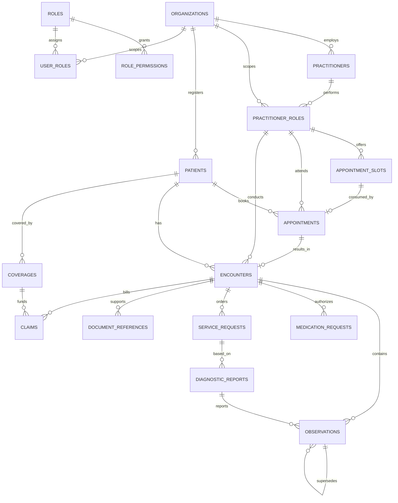

# Phase 1 FHIR-aligned ERD

Each clinic is an `organizations` tenant. All patient-linked clinical resources carry
that tenant key and retain the corresponding FHIR resource shape in relational fields.

| Table                  | FHIR resource        | Key relationship / design choice                                                 |
| ---------------------- | -------------------- | -------------------------------------------------------------------------------- |
| `organizations`        | Organization         | Clinic/facility tenant.                                                          |
| `practitioners`        | Practitioner         | Staff identity; role assignment is separate.                                     |
| `practitioner_roles`   | PractitionerRole     | Connects staff capability to one organization.                                   |
| `patients`             | Patient              | Supports both `auth_user_id` and per-organization `walk_in_id`.                  |
| `appointment_slots`    | Slot                 | Lockable provider availability; one slot can be consumed by one appointment.     |
| `appointments`         | Appointment          | Uses the requested booking lifecycle.                                            |
| `encounters`           | Encounter            | Consultation record with structured SOAP fields.                                 |
| `observations`         | Observation          | Immutable, corrected by a successor through `supersedes_id`.                     |
| `medication_requests`  | MedicationRequest    | Connects patient, encounter, and requester.                                      |
| `service_requests`     | ServiceRequest       | `category` is `laboratory` or `referral`.                                        |
| `diagnostic_reports`   | DiagnosticReport     | References the order; result observations point back to it.                      |
| `document_references`  | DocumentReference    | Medical certificates and uploaded/generated clinical documents.                  |
| `coverages` / `claims` | Coverage / Claim     | Present for future HMO workflows.                                                |
| `audit_log`            | Audit infrastructure | Append-only audit trail keyed by tenant, table, record, actor, action, and time. |

`roles`, `role_permissions`, and `user_roles` are authorization data rather than FHIR
clinical resources. Roles are definitions, while `user_roles` scopes each assignment to
an organization for Phase 2 federation.
